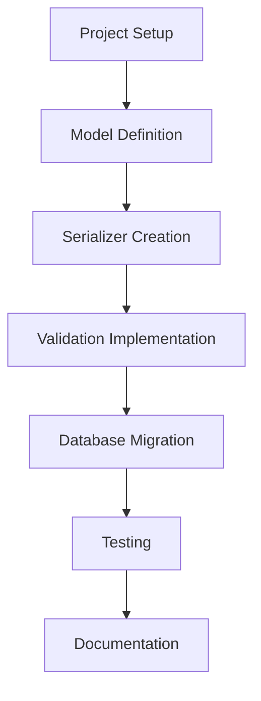

# Advanced API Project Architecture Summary

## Overview
This document provides a comprehensive summary of the architecture for the advanced API project using Django REST Framework with custom serializers for complex data structures and nested relationships.

## Project Structure
```
advanced-api-project/
├── advanced_api_project/          # Project configuration
│   ├── __init__.py
│   ├── settings.py               # Project settings
│   ├── urls.py                   # URL routing
│   ├── wsgi.py
│   └── asgi.py
├── api/                          # Main application
│   ├── __init__.py
│   ├── admin.py                  # Admin interface configuration
│   ├── apps.py
│   ├── models.py                 # Data models (Author, Book)
│   ├── serializers.py            # Custom serializers
│   ├── views.py                  # API views
│   ├── urls.py                   # App URL routing
│   ├── tests.py                  # Unit tests
│   └── migrations/               # Database migrations
│       └── __init__.py
├── manage.py                     # Django management script
└── requirements.txt              # Project dependencies
```

## Key Components

### 1. Data Models
- **Author Model**: Represents book authors with a name field
- **Book Model**: Represents books with title, publication year, and author relationship
- **Relationship**: One-to-many from Author to Book using ForeignKey

### 2. Serializers
- **BookSerializer**: Handles serialization of Book instances with custom validation
- **AuthorSerializer**: Handles serialization of Author instances with nested Book serialization
- **Validation**: Custom validation to prevent future publication years

### 3. API Features
- Nested serialization of related objects
- Data validation for business rules
- RESTful API endpoints (to be implemented in views)
- JSON serialization for all model instances

## Implementation Flow



## Technical Requirements
- Python 3.8+
- Django 4.2+
- Django REST Framework 3.14+
- SQLite (default) or other Django-supported database

## Development Process
1. Environment setup and dependency installation
2. Project and app creation
3. Model implementation with proper relationships
4. Serializer implementation with nested relationships
5. Custom validation implementation
6. Database migration
7. Testing and validation
8. Documentation

## Testing Strategy
- Manual testing using Django shell
- Validation testing with valid and invalid data
- Nested serialization verification
- Relationship integrity checks

## Documentation
- Model documentation explaining relationships
- Serializer documentation explaining nested handling
- Validation logic documentation
- Testing procedures documentation