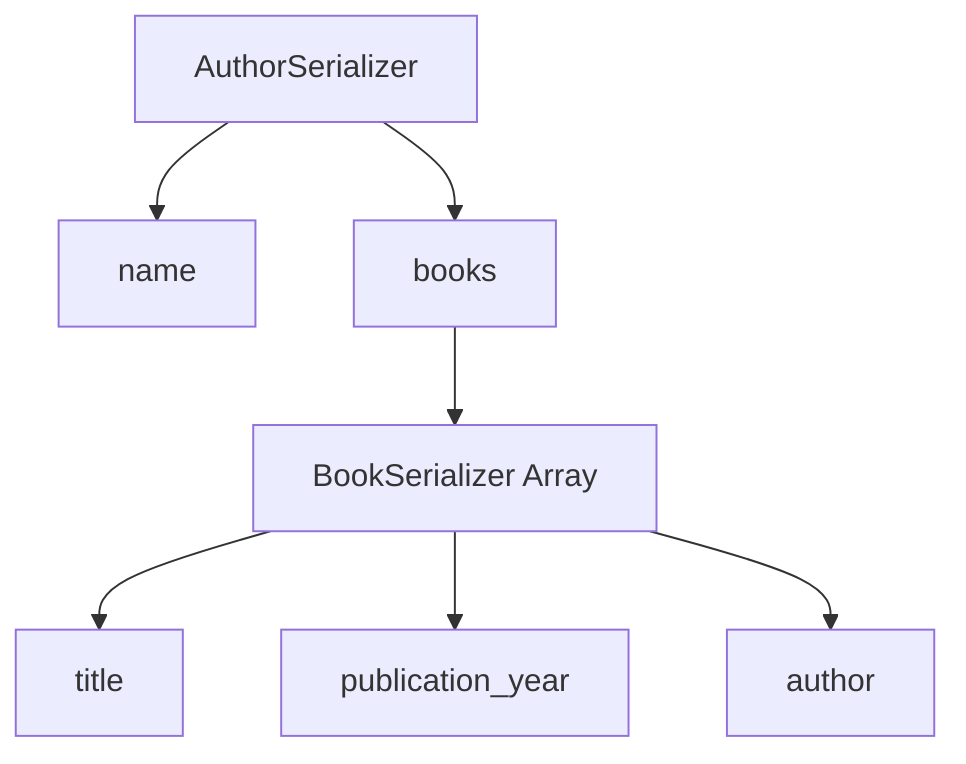

# Serializer Design Documentation

## BookSerializer

### Fields
- All fields from the Book model (title, publication_year, author)
- Uses `__all__` to include all model fields

### Validation
- Custom validation for `publication_year` field
- Validation ensures the publication year is not in the future
- Uses `validate_publication_year` method for custom validation logic

### Purpose
The BookSerializer handles serialization and deserialization of Book model instances. It converts Book model instances to JSON representations and vice versa.

## AuthorSerializer

### Fields
- `name`: Serializes the author's name
- `books`: Nested serialization of related books using BookSerializer
- Uses `BookSerializer(many=True, read_only=True)` for the books field
- The `many=True` parameter indicates multiple books can be serialized
- The `read_only=True` parameter prevents books from being modified through this serializer

### Nested Relationship Handling
- The nested BookSerializer dynamically serializes all books related to an author
- Uses the related_name 'books' from the Book model's ForeignKey to Author
- When an Author instance is serialized, all related books are included in the JSON output

### Purpose
The AuthorSerializer handles serialization and deserialization of Author model instances with their related books. It provides a complete representation of an author including all their books.

## Serializer Diagram


## Validation Logic

### BookSerializer Validation
- Custom method `validate_publication_year` checks if the year is not in the future
- If validation fails, raises `serializers.ValidationError`
- If validation passes, returns the validated data

### Implementation Example
```python
def validate_publication_year(self, value):
    from datetime import datetime
    if value > datetime.now().year:
        raise serializers.ValidationError("Publication year cannot be in the future.")
    return value